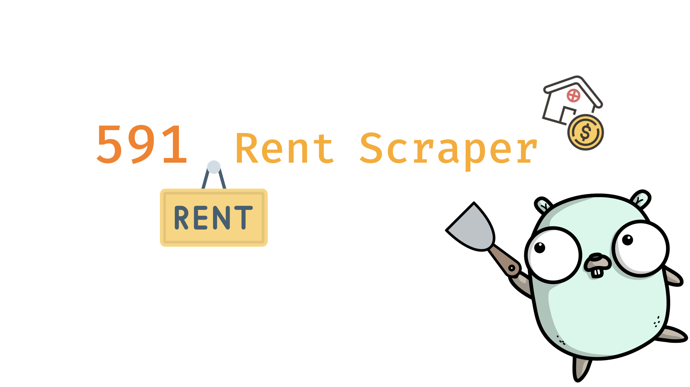

# fiveN1 Rent Scraper


[](https://godoc.org/github.com/neighborhood999/fiveN1-rent-scraper)
[](https://travis-ci.org/neighborhood999/fiveN1-rent-scraper)
[](https://goreportcard.com/report/github.com/neighborhood999/fiveN1-rent-scraper)

> a.k.a 591 rent scraper.

Easy scraping [591](https://rent.591.com.tw/) rent information.

## Requirement

```sh
$ go get -u github.com/vinta/pangu
$ go get -u github.com/PuerkitoBio/goquery
$ go get -u github.com/google/go-querystring/query
```

## Installation

```sh
$ go get github.com/neighborhood999/fiveN1-rent-scraper
```

## Usage

```go
import (
	"log"

	"github.com/neighborhood999/fiveN1-rent-scraper"
)

func main() {
	o := rent.NewOptions()
	url, err := rent.GenerateURL(o)
	if err != nil {
		log.Fatalf("\x1b[91;1m%s\x1b[0m", err)
	}

	f := rent.NewFiveN1(url)
	if err := f.Scrape(1); err != nil {
		log.Fatal(err)
	}

	json := rent.ConvertToJSON(f.RentList)
	log.Println(string(json))
}
```

And output json:

```json
{
  "1": [
    {
      "preview":
        "https://hp1.591.com.tw/house/active/2013/11/04/138356961541004002_210x158.crop.jpg",
      "title": "松山路套房 * 交通方便近捷運後山埤站 *",
      "url": "https://rent.591.com.tw/rent-detail-5857738.html",
      "address": "信義區 - 松山路 119 巷",
      "rentType": "沒有格局說明",
      "optionType": "獨立套房",
      "ping": "6",
      "floor": "樓層：3/4",
      "price": "9,000 元 / 月",
      "isNew": true
    }
  ]
}
```

Index number is the representation **page number**, every index contain **30** items. 🏠

## Options

Create default options then you can generate url:

```go
o := rent.NewOptions()
url, _ := rent.GenerateURL(o)
log.Println(url)
```

or you can setting more detail for your requirement, please reference below:

```go
type Options struct {
	Region    int    `url:"region"`    // 地區 - 預設：`1`
	Section   string `url:"section"`   // 鄉鎮 - 可選擇多個區域，例如：`section=7,4`
	Kind      int    `url:"kind"`      // 租屋類型 - `0`：不限、`1`：整層住家、`2`：獨立套房、`3`：分租套房、`4`：雅房、`5`：車位，`6`：其他
	RentPrice string `url:"rentprice"` // 租金 - `2`：5k - 10k、`3`：10k - 20k、`4`: 20k - 30k；或者可以輸入價格範圍，例如：`0,10000`
	Area      string `url:"area"`      // 坪數格式 - `10,20`（10 到 20 坪）
	Order     string `url:"order"`     // 貼文時間 - 預設：`posttime`
	OrderType string `url:"ordertype"` // 排序方式 - `desc` 或 `asc`
	Sex       int    `url:"sex"`       // 性別 - `0`：不限、`1`：男性、`2`：女性
	HasImg    int    `url:"hasimg"`    // 過濾是否有「房屋照片」 - `0`：否、`1`：是
	NotCover  int    `url:"not_cover"` // 過濾是否為「頂樓加蓋」 - `0`：否、`1`：是
	Role      int    `url:"role"`      // 過濾是否為「屋主刊登」 - `0`：否、`1`：是
}
```

## Multiple Page Scrape

Default will scrape first page, if you want to scrape more pages, setting page amount in `Scrape` method:

```go
f := rent.NewFiveN1(url)
f.Scrape(5) // scrape page 1-5
```

If page amount `> 1`, it will start goroutine automatically for scrape to correspond to page number.

### `urlJumpIp` Code List

| Area   | Code |
| :----- | :--- |
| 台北市 | 1    |
| 基隆市 | 2    |
| 新北市 | 3    |
| 新竹市 | 4    |
| 新竹縣 | 5    |
| 桃園市 | 6    |
| 苗栗縣 | 7    |
| 台中市 | 8    |
| 彰化縣 | 10   |
| 南投縣 | 11   |
| 嘉義市 | 12   |
| 嘉義縣 | 13   |
| 雲林縣 | 14   |
| 台南市 | 15   |
| 高雄市 | 17   |
| 屏東縣 | 19   |
| 宜蘭縣 | 21   |
| 台東縣 | 22   |
| 花蓮縣 | 23   |
| 澎湖縣 | 24   |
| 金門縣 | 25   |
| 連江縣 | 26   |

### Secion Code List

More section code list please reference [Section Code List](./docs/section-code-list.md).

## LICENSE

MIT © [Peng Jie](https://github.com/neighborhood999)
